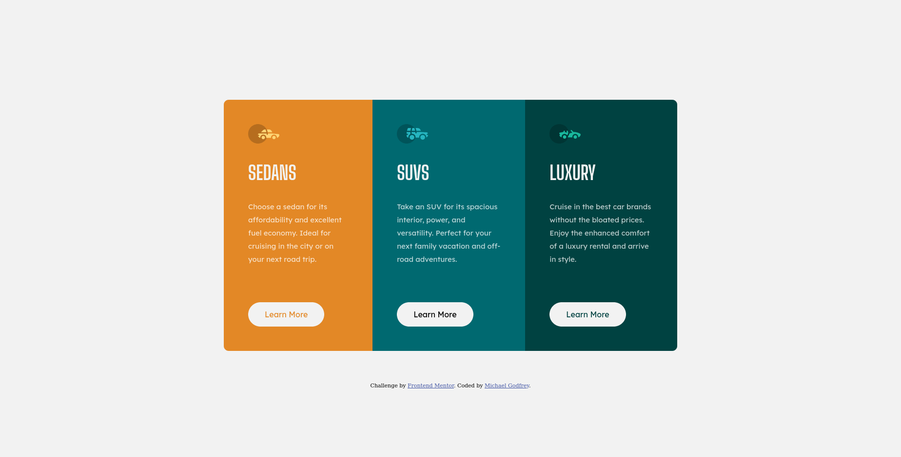

# Frontend Mentor - 3-column preview card component solution

This is a solution to the [3-column preview card component challenge on Frontend Mentor](https://www.frontendmentor.io/challenges/3column-preview-card-component-pH92eAR2-). Frontend Mentor challenges help you improve your coding skills by building realistic projects.

## Table of contents

- [Overview](#overview)
  - [The challenge](#the-challenge)
  - [Screenshot](#screenshot)
  - [Links](#links)
- [My process](#my-process)
  - [Built with](#built-with)
  - [What I learned](#what-i-learned)

## Overview

### The challenge

Users should be able to:

- View the optimal layout depending on their device's screen size
- See hover states for interactive elements

### Screenshot

### Links

- Solution URL: [Frontend Mentor Solution](https://www.frontendmentor.io/solutions/3column-preview-card-component-dq4M7vC5j)
- Live Site URL: [Live Site](https://michagodfrey.github.io/frontend-mentor-3-column-card/)

## My process

### Built with

- Semantic HTML5 markup
- CSS custom properties
- Flexbox
- Mobile-first workflow

### What I learned

This was the second Frontend Mentor challenge that I completed. The aims were to practice vertical and horizontal centering, BEM naming of CSS classes, and CSS grid. I did these reasonably well and received excellent feedback. Later, with more experience I returned to this and made improvements. One significant change was dropping grid for flexbox, which makes more sense for this simple element.
